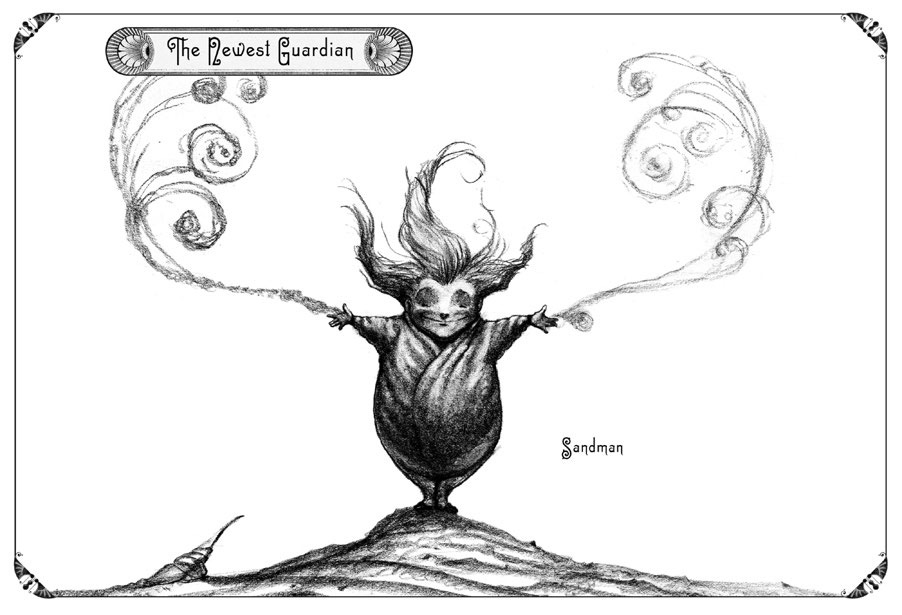

ЧАС МИНАЄ НЕВПИННО, КОЛИ ти спиш. Ти можеш заплющити очі, коли ніч, а розплющивши їх знову побачиш ранок. Та все ж години пройшли, здавалося, не довше, ніж дрейфуюча подорож листя в м'якому бризі.
  Дивні, дивовижні і жахливі подорожі є нормою у снах. Незвідані землі приходять і йдуть. Епічність снів розігрується. Війни ведуться і виграються. Кохані втрачаються або знаходиться. Повністю инше життя проживається, коли ми спимо. І тоді ми прокидаємся з розчаруванням, або полегшенням, як ніби нічого не трапилось.
  Але інколи щось повинно трапитись.

  

  Наяву, Вартові втратили одного зі своїх на користь могутньої сутністи, відомої як мати-природа.

  Але дивний маленький чоловічок спав більше днів і ночей, ніж будь-який календар може порахувати. Дрімаючий хлопець був кольору золотого піску, він виглядав, як зроблений з матерії. Його неслухняне волосся вертілося і крутилося, коли він спав. Він відпочивав у вкритому дюнами центрі крихітного острова у формі зірки, який годі було й знайти людям, бо він був неземного походження.Острів не був приєднаний до нічого: жодна суша під океаном не закріпила його на місці. Виходить, це був єдиний острів на нашій планеті, який справді плавав над водою.Через це він дрифтував. У червні він міг би бути в Тихому океані і до липня дібрався б до узбережжя Мадаґаскару, його місцезнаходження відомо лише місяцю і зіркам.
  Це було доречно, бо колись цей острів був зіркою. Його врятував лідер Вартових, Цар Лунар, або, як ми його називаємо, «Людина на Місяці». Але це було багато років тому.
  Цієї найсприятливішої ночі Цар Місяць гукнув маленького і нешкідливого на вигляд хлопця, який тихенько хропів серед чарівних пісків острова. 
  Але як пробудити людину з минулого? Того, хто подорожував океанами часу і простору. Стійкого хлопця, який керував найшвидшою метеором на небі. Героя тисячі битв проти Пітча, короля кошмарів. Цей маленький воїн колись був найвідважнішим виконавцем бажань у всьому космосі. Як розбудити людину, яка не розплющувала очей із великих стародавніх днів Золотого Віку?  
  Як і з більшістю речей, відповідь проста. . 
  Людина на Місяці відправила посланця місячного променя з єдиним прошепотом: «Я хочу, щоб Ви допомігли. Потрібні Ваші повноваження». 
  За мить у маленького чоловічка розплющилися очі. Відпав віковий сон. Там він стояв високий, як міг: Сандерсон Менснозі. Потім Людина на Місяці передав своє повне повідомлення. Сандерсон Менснузі уважно слухав.
  Багато чого сталося, поки він спав.
  Пітч повернувся і знову загрожує галактикам. Але довгий сон Сандерсона Менснузі був найпродуктивнішим. Тепер він був сильнішим, ніж будь-коли: мав владу над світом снів. Фактично, кожна піщинка на його острові тепер містила сон — один сон для кожної ночі його майже нескінченного сну, і всі вони були хорошими снами, достатньо сильними, щоб боротися з будь-яким кошмаром. 
  Коли Людина на Місяці закінчив, Сандерсон Манснузі помахом руки оживив свій острів. Його пісок закружляв навколо, і острів перетворився на хмару, яка піднесла його з моря в небо.
  За допомогою місячних променів він поплив золотою хмарою до своєї місії: допомогти Вартовим. Врятувати і визволити дівчину на ім'я Кетрін. І зупинити Пітча назавжди.
  Цей «Пісочний чоловік» був готовий шукати свого давнього ворога та старих друзів. Він був готовий протистояти будь-якій небезпеці, яка чекала попереду. 
  А її було багато.